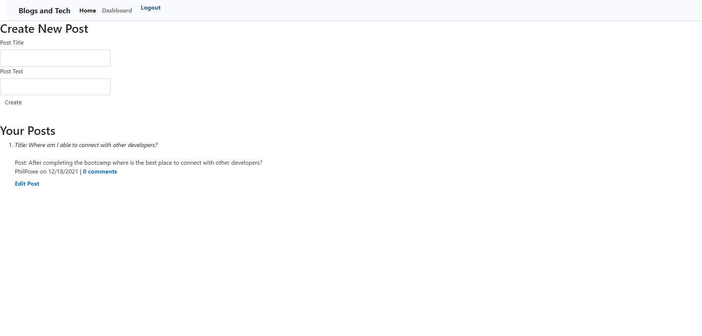
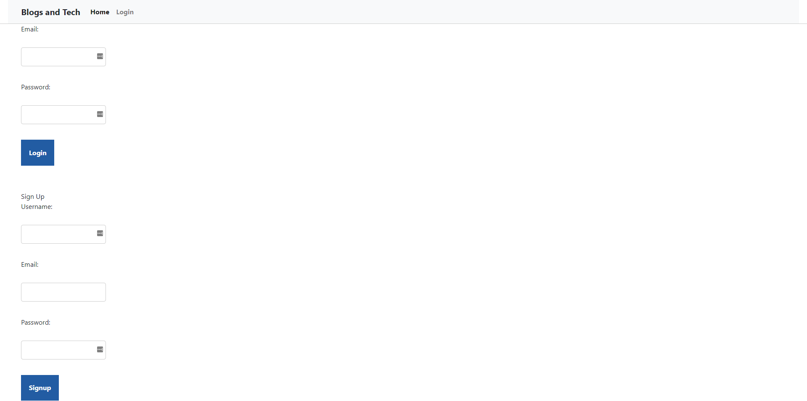

# blogsAndTech>

Login, sign up, post, and comment on a tech blog 
>[Link to website](https://blogs-and-tech.herokuapp.com/)
## Table of Contents
* [Description](#Description)
* [General Info](#General-Info)
* [Features](#Features)
* [Screenshot](#Screenshot)
## Description
Using MVC, this application allows you to login/signup/post/comment on a tech blog named Blogs and Tech.
## General Info
Using Models, Views, and Controllers users are able to create an account and later log in. Post a thread and comment on other threads
## Features
* Create an account
* Log in to that account
* Post a discussion to have or an article
* Comment on other discussions or threads
* Log out
### Screenshot

